# End-to-End Speech Translation of Contemporary Egyptian Arabic Dialect
# 1. Problem Definition:
According to there is a high Demand on Egyptian dialect language translation, facing a problem as people even who are Arabic native speakers but not a specialist in Arabic cannot speak Arabic (MSA) for a long time without switching to their own dialect and there is no speech translation model based on the end-to-end architecture for the Egyptian dialect language, so we will deploy a model that can be supported as a service to understand Egyptian dialect. Our project is based on identifying the human voice audio extracted from films and YouTube videos and converting them into text to make communication easier.

# 2. Background  

End-to-end learning is the process of training a potentially complicated learning system represented by a single model particularly, a Deep Neural Network that represents the whole target system, excluding the intermediary layers that are typically present in standard pipeline designs. We discovered that academics have been working on deep learning techniques such as CNN models that can handle sequential data, the encoder-decoder model, and RNN models that do not need enormous parallel data sets to translate these languages. RNN-based approaches have been used to study speech recognition. RNNs come in two major varieties: GRU and LSTM. techniques centred on manual feature extraction, neural networks, RNNs and CNNs, and more recently transformers, which have demonstrated remarkable results on ASR. The studies that were pertinent to our subject lacked data, as we discovered.

There are many similarities between the areas of automated speech recognition (ASR) and machine translation (MT), including their conceptual foundations, continuous research interests, remarkable developments over the past two decades, and the extensive adoption that has followed. Both ASR and MT require improvement and, as a result, may not always yield reliable results. To create speech translation applications, MT and voice recognition algorithms that have each been trained using different datasets are typically integrated. Once the recognizer has sent all its errors to the MT system, it then adds its own errors. When errors combine, the results are typically catastrophic. Systems for text-to-text translation and speech recognition have advanced in recent years, thanks to the development of both hardware and software technologies. However, voice translation is most frequently carried out using a combination of speech recognition and machine translation technology. This project aims to develop an end-to-end speech translation system. 

In [1] This project demonstrates that, when all systems are implemented using the Transformer architecture, the end-to-end speech translation system outperforms the concatenation of speech recognition and machine translation systems.

In [2] A popular topic in recent years, end-to-end speech translation tries to use an end-to-end paradigm to convert a segment of audio into a particular language. Traditional methods make use of techniques for multi-task learning, and pre-training is inadequate for this task due to the enormous time difference between pre-training and fine-tuning. They suggest a Tandem Connectionist Encoding Network (TCEN), which closes the gap by pre-training the attention module, reusing all subnets in fine-tuning, and maintaining the functions of subnets.
They propose two simple but effective methods to ensure that the semantic representation and sequence length of the voice encoder outputs, and the MT encoder inputs are consistent. Regardless of the model's underlying principles, experimental data show that our model significantly improves En-De and En-Fr translation.

In [3], they suggested using CNN and BiGRU along with an attention mechanism to perform MT between English and Arabic texts. By leveraging our corpora to identify the most important words in the input sentences, our approach will help Arabic MT perform better. The model used for this study, however, was only able to accept text input from users; there was no way to translate voice messages into the Egyptian dialect.

In [4], there a framework to translate the Jordanian dialect into Modern Standard Arabic (MSA) using Deep Learning the RNN encoder-decoder model, which provided superior results on the level of our manually created dataset. The framework in this research was limited for Jordanian dialect into Modern Standard Arabic Not Egyptian Dialect language and the user cannot enter an audio as an input to system just a text.

# 3. Project Context:

we used the open-source, free tool Video-subtitle-extractor (VSE) to extract subtitles from videos that don’t contain their transcripts. We used "the subtitle-Edit" tool for applying the data segmentation and cutting the Egyptian audios into a smaller length and exporting its sentences in the file (*.txt). we used libraries to deal with audio signals and process them like "Librosa" to reduce the noise also, we used "Figma" design tool and "Adobe XD" to design our prototype.  Finetuned Speech Translation model called "Whisper" also needed "the Hugging Face trainer" to define the training arguments during tuning the whisper model, and We used the "Flask tool" in the deployment phase and pushed our model onto a “hugging face web” to make the connection between the flask and our model easy to respond to translation. Lastly, because of the lack of resources we needed to work on "Saturn Cloud" to get the benefits of stronger processing power.

# 4. Design Overview of the project
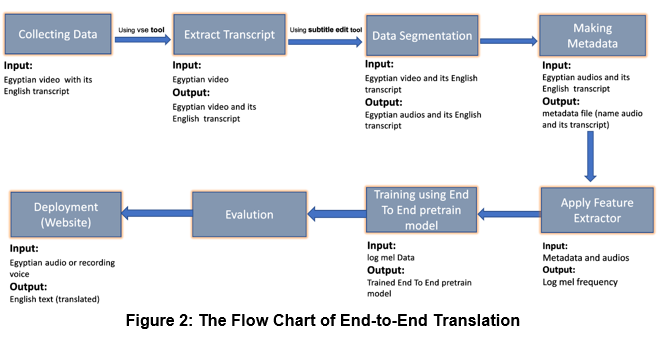

# 4.1. Requirements

There is a big problem in the translation of Egyptian dialect speech as it considered as a low source language so, we followed some steps that included user and system requirements to provide a clear image of the problem to reach the optimal solution.

## 4.1.1 User Requirements

### 4.1.1.1 Functional Requirements 

In this section, we provided a series of operations to get our solution, which include:
-	Collecting Data in order to have a dataset
-	Applying preprocessing on the data using feature extraction techniques such as MFCC
-	Training our model on a big-scale data
-	Pushing our championed model on hugging face web.
-	Creating the web interface 
-	Connecting the web Interface with the championed model to get out the English translation.

### 4.1.2.1 Non-Functional Requirements

We followed collection of steps to reach the optimal solution;
-	Putting data as Egyptian videos in a suitable form.
-	Using the open-source, free tool VSE to extract subtitles from Egyptian videos which haven’t contain their English transcripts.
-	Using subtitle edit program which helped us to cut the audios in a professional way and extract their subtitles. 
-	Making the metadata file, each record in the metadata consists of the audio name and its translation.
-	Maintain the data (segment it with a bigger length)
-	How to process data for speech translation
-	Reading papers to choose the suitable end to end speech recognition pretrained model. 
-	Training data with the suitable pretrained model.

## 4.1.1 System Requirements

-	Processing power needed (GPU).
-	Framework versions

    •	Transformers 4.26.0.dev0

    •	Pytorch 1.11.0

    •	Datasets 2.1.0

    •	Tokenizers 0.12.1

    •	Ffmpeg version 4

# 4.2 Detailed Design
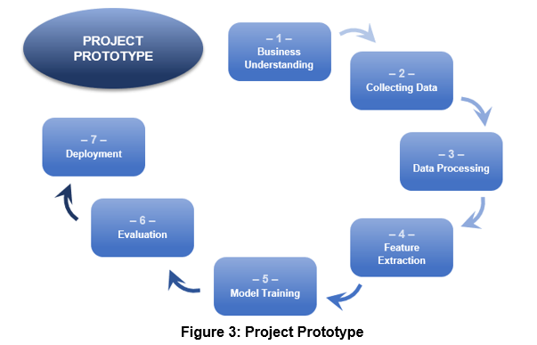

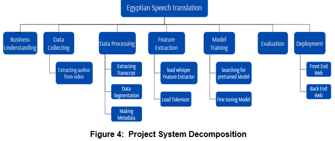

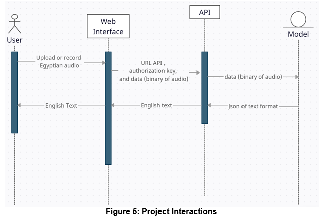

# 4.3 Implementation 

In order to meet our requirements after many experiments and to get the benefits of transfer learning (save resources and improve efficiency) we chose to fine-tune Whisper model developed by OpenAI, which is trained on a large dataset of audio recordings to generate realistic speech and audio. Because among all the models that trained on Arabic it has the least error rate (18.1). The Whisper architecture is end-to-end approach, and an encoder-decoder model based on Transformers, often known as a sequence-to-sequence model. It converts a series of audio spectrogram features into a series of text tokens. The feature extractor first converts the raw audio inputs to a log-Mel spectrogram. The spectrogram is then encoded by the Transformer encoder to generate a series of encoder hidden states. Finally, the decoder anticipates text tokens based on both the preceding tokens and the encoder's concealed states.[5]

We'll fine-tune the small checkpoint version with 244M parameters (= 1GB). In terms of data, we'll train and test our system using our own dataset of Egyptian dialect which is low-source language.
We used transformers to load and train our version of Whisper model.

•	We loaded Feature Extractor, Tokenizer and Data Whisper model has specific feature extractor and tokenizer, called WhisperFeatureExtractor and WhisperTokenizer respectively. Using The data collator for a sequence-to-sequence speech model that treats the input_features and labels independently 

•	The input_features are padded to 30s and converted to a log-Mel spectrogram of fixed dimension by action of the feature extractor and convert the input_features to batched PyTorch tensors. 

•	For un-padded labels, we first pad the sequences to the maximum length in the batch using the tokenizer's pad method, then cut the BOS token from the start of the label sequence as we append it later during training. 

•	Define the training configurations using Hugging Face Trainer in constructing the training schedule

 max_steps
      	 save_steps
      	learning_rate=1e-5 "The initial learning rate for AdamW optimizer"
      	train_batch_size
      	eval_batch_size
      	metric_for_evaluation

We trained our model with different values for arguments and different sizes of data 

## 4.4. Testing 

## 4.4.1. Data Plan

## 4.4.1.1 Data Collecting

We collected our data from multiple sources on websites as there weren’t sources for Egyptian dialect datasets, so, we extracted the English transcripts from 400 hours of Egyptian videos.

## 4.4.1.2 Data processing

## 4.4.1.2.1 Extracting Transcript

We extracted the videos, some with their transcripts and others without transcripts, so, we used the open-source, free object detection tool named Video-subtitle-extractor (VSE) as shown in figure 6 which detects the transcript from the film to extract subtitles from videos which don’t contain their transcripts.

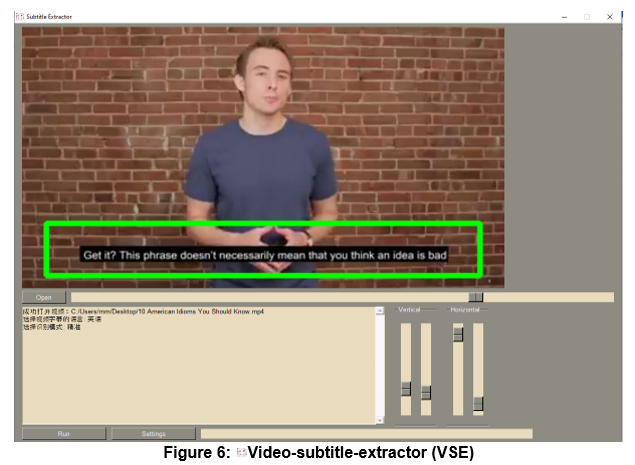

## 4.4.1.2.2 Data Segmentation

After collecting the data, we used “subtitle Edit” tool as shown in figure 7 for applying the data segmentation process to filter the data and cutting the Egyptian videos into small audio maximum 15 seconds in length and exporting their sentences to files (*.txt).    

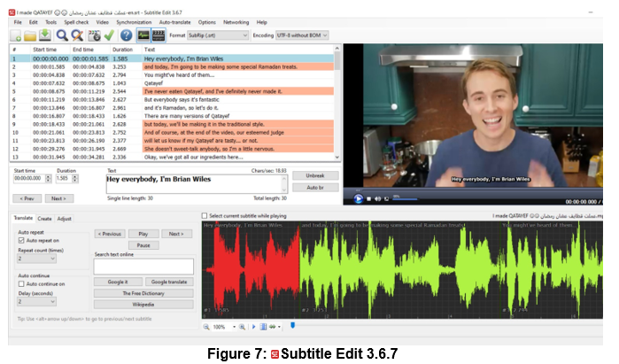

For data segmentation, we created a python script "srt-resync.py" for synchronization issues, as there was a synchronization between the audio and its translation, where the voice comes before the translation, or the translation comes before the voice.
Some transcripts contained words that didn’t in Egyptian videos as shown in figure 8, so we also created a python script "filter-subtitles.py" for:

1.	Remove font tags and text contained within, e.g.  Hey\ is removed.

2.	Remove subtitle entries containing asterisks: *.

3.	Remove subtitle lines containing ♪ or #

4.	Remove sound effects: text contained with and including parenthesis (BANG) and brackets [boom].

5.	Replace names with dashes, e.g. GARY: Hey or Gary: Hey to - Hey.

6.	Remove author tags e.g.   XoXo Subtitles by PwnedDude967 XoXo.

7.	Fix erroneous comma spacing, e.g.
 Hey, what's up? Nothing,my man 
to
 Hey, what's up? Nothing, my man.

8.	Remove lone symbols such as,    ?, -, #, _.
So, we can filter subtitles as shown in figure 9.

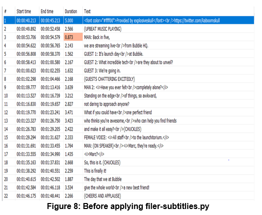

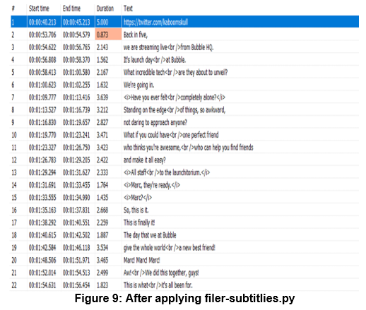

There was audio in the data for less than 5 seconds, so we made a Python script (wav-Merge.py) to merge that audio together to make the model get better results. As shown in figure 10 and 11.

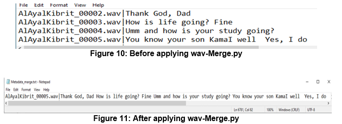

## 4.4.1.2.3 Making Metadata

For making the metadata, we used python script (MateData-make.py) for renaming wav files and making a Metadata file (*.txt) that contains the wav file name and its transcript. 
And this is the final shape of our dataset after data segmentation as shown in Figure 12.

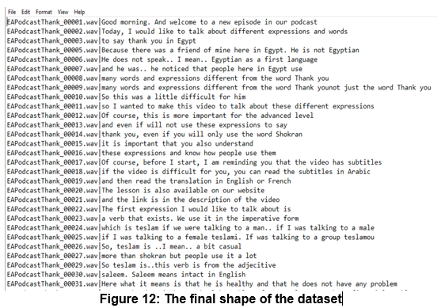

## 4.4.2 Validation & Verification 

For Evaluating our model, we used the WER metric it is a measure of how accurate an Automatic Speech Recognition system performs
 
Figure 13: WER Formula

-	  Where:

o	 S is the number of substitutions,

o	 D is the number of deletions,

o	 I is the number of insertions,

o	C is the number of correct words,

o	N is the number of words in the reference (N= S+D+C)

Factors that can affect the WER without necessarily reflecting the capabilities of the ASR technology itself, so it is okay to have a word error rate above 100

	Recording quality 

	Microphone quality 

	Speaker pronunciation 

	Background noise 

	Unusual names, locations, and other proper nouns 

	Technical or industry-specific terms

First, we got our baseline -in order to compare it with our results-by testing the whisper pretrained model on our data –6 hours- and we got a WER with a value 121.657, And the model did not recognize most he audios language correctly

Second, we defined a function “compute_metrics" that:

	 takes our model predictions and returns the WER metric. 

	 replaces -100 with the pad_token_id in the label_ids  

	 decodes the predicted and label ids to strings.  

	computes the WER between the predictions and reference labels on test data "6h" 

# 3. Overall Results and Analysis
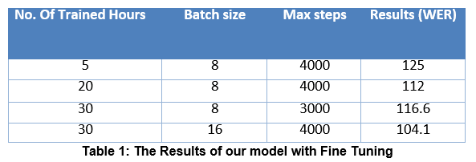

We trained our model with the max hours that our resources could handle which is 30H for training and 6 H for testing with different batch size once 8/batch, and another with 16/batch and we got that: 

•	The model with batch size of 16 gave us 104.12 WER and the validation loss decreased which means the model converges –figure 14

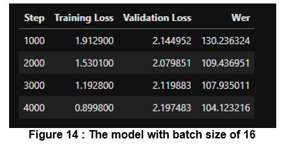

•	The model with batch size of 8 gave us 116.6 WER and, the validation loss increased which means the model had an overfitting problem- figure 11

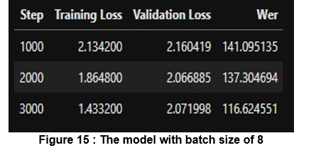

# 5. Deployment Plan

After selecting the Champion model, we built a website with a usable interface for the end user as shown figure 9. So, the user has two options to translate Egyptian speech into English text. This website includes two components: The Frontend and the Backend.

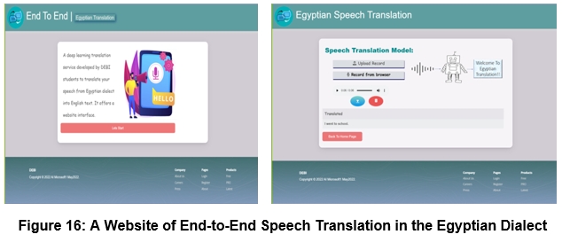

## 5.1. Frontend web development

 We used HTML, CSS, JavaScript, jQuery, and Bootstrap to build the design of the website, so that users could view and interact with it. Through it, the user can upload an Egyptian audio file that has an extension, such as wav, mp3, flac, and others and translate an Egyptian audio into English text as shown in figure 10. 

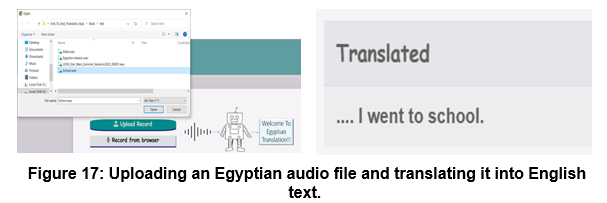

In addition, the user can record Egyptian voices from the browser by following the steps shown in Figure 11:

1.	The user presses the button "Record from browser" and talks with his or her voice. The title of that button changes to "Click to stop recording". 

2.	To stop his or her recording, the user can press the button "Click to stop recording," 

3.	After recoding, audio appears on the browser, so the user can download and remove it from the browser and submitting his or her Egyptian voice to our model to translate into English text.
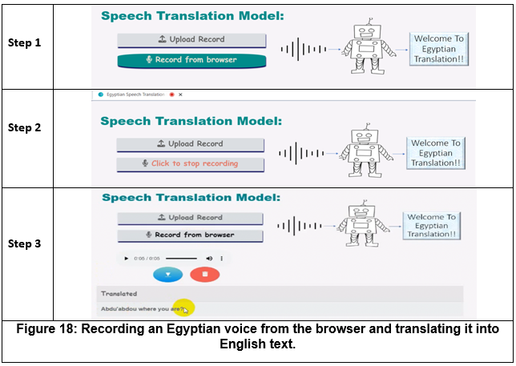

# 5.2. Backend web development

We used the Flask library to interconnect our model with the website to show the results of Egyptian speech translation. After training, we pushed our model onto a hugging face web to make the connection between the flash library and our model easy to respond to translation.
We wrote a Python script called "Main.py" that takes Egyptian audio or recordings, sends them to our model on the hugging face web, and returns the translation as English text in 38.683963775634766-mile seconds. We created a script to make the user hear the Egyptian sound before the translation when the Egyptian audio file is uploaded. And we created a script that adds audio with options such as download and remove buttons on the browser as shown in figure 12.

# 6. Conclusions and Future Works 

We got to gain more depth into the practical aspects End-to-End Architectures, Transfer learning, Automatic Speech Translation (AST), and Hugging Face Transformers Hugging Face, to fine-tune the Whisper model, which is trained on a large dataset of audio recordings to generate realistic speech and audio for first time on the Egyptian dialect with our own dataset and got results with 104,1 WER.
Our future work will be evaluating our model using the Bilingual Evaluation Understudy and training our model on the entire 400 H of data 

# 7. References
[1] End-to-end speech translation - upcommons.upc.edu (no date). Available at: https://upcommons.upc.edu/bitstream/handle/2117/129165/Speech_Translation_Final_Report.pdf?sequence=1 

[2] Wang, C. et al. (2019) Bridging the gap between pre-training and fine-tuning for end-to-end speech translation, arXiv.org. Available at: https://arxiv.org/abs/1909.07575 

[3] Bensalah, N. et al. (1970) Cran: An hybrid CNN-RNN attention-based model for Arabic Machine Translation, SpringerLink. Springer Singapore. Available at: https://link.springer.com/chapter/10.1007/978-981-16-3637-0_7 

[4 ] Al-Ibrahim, R. and M. Duwairi, R. (2020) Neural machine translation from Jordanian dialect to Modern Standard Arabic. Available at: https://ieeexplore.ieee.org/document/9079061/ (Accessed: January 2023).

[5] Radford, A. et al. (2022) Robust speech recognition via large-scale weak supervision, arXiv.org. Available at: https://arxiv.org/abs/2212.04356 

[6] (PDF) audio pre-processing for Deep Learning - Researchgate (no date). Available at: https://www.researchgate.net/publication/347356900_Audio_Pre-Processing_For_Deep_Learning 

[7] Denoising speech for MFCC feature extraction using wavelet (no date). Available at: https://ieeexplore.ieee.org/document/8534807 

[8] Improving CTC using stimulated learning for sequence modeling (no date). Available at: https://ieeexplore.ieee.org/document/8682700 

[9] Hannun, A. (2020) Sequence modeling with CTC, Distill. Available at: https://distill.pub/2017/ctc/ 

[10] Openai (no date) Whisper/Whisper at main · openai/whisper, GitHub. Available at: https://github.com/openai/whisper/tree/main/whisper 
